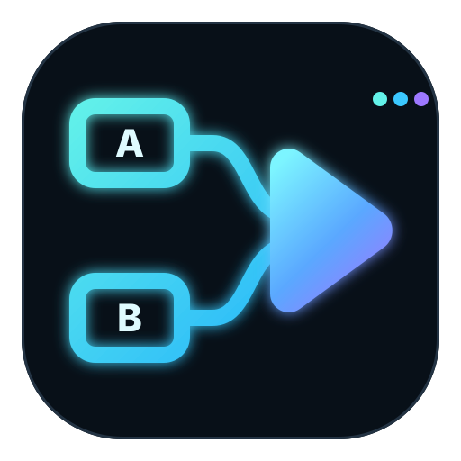
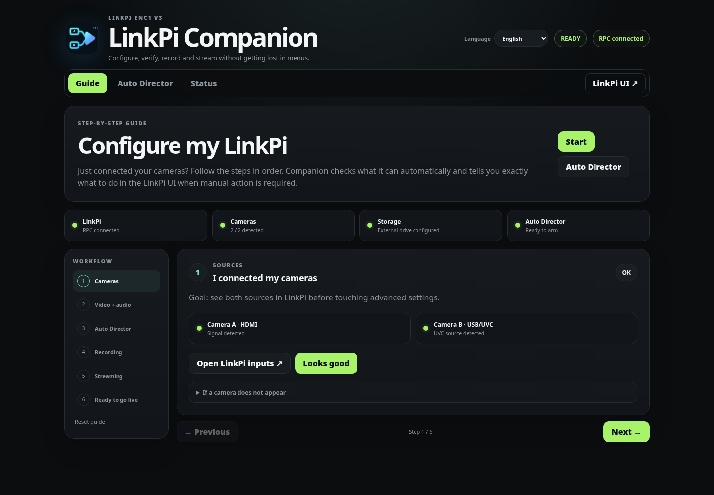
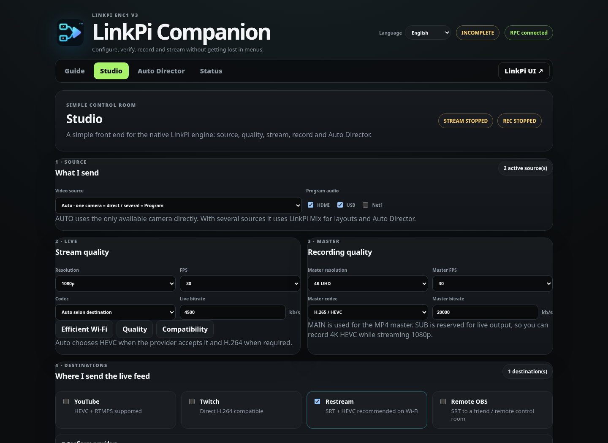
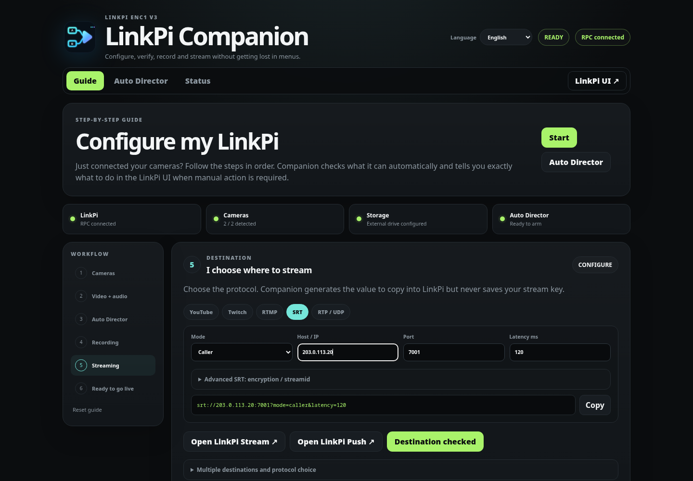
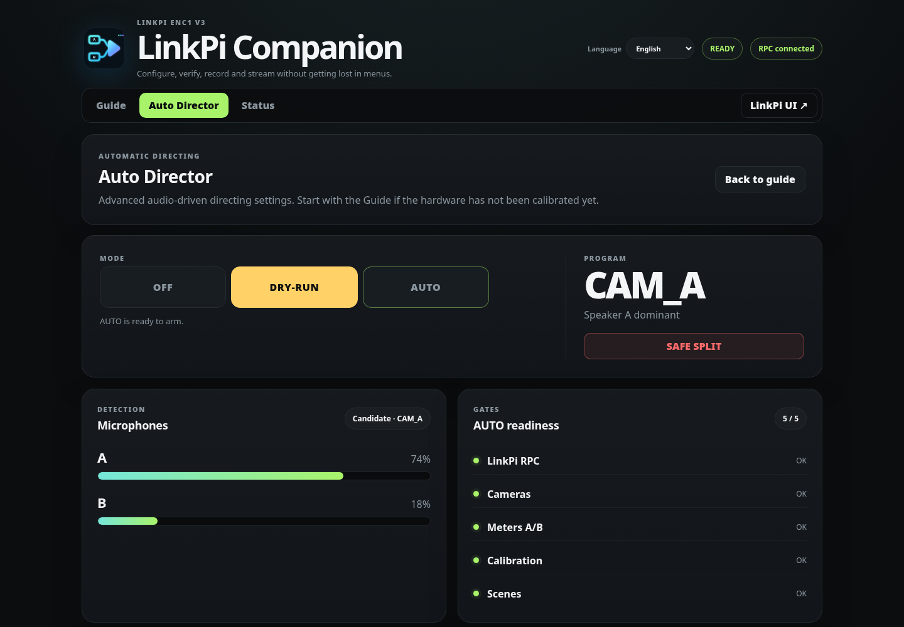

<p align="center">
  
</p>

<h1 align="center">LinkPi Companion</h1>

<p align="center"><strong>把 LinkPi 变成一套有引导的多机位录制、推流与自动导播工作站。</strong></p>

<p align="center">
  摄像机设置、录制检查、RTMP/RTMPS/SRT/RTP 助手，以及由音频驱动的 Auto Director —— 全部直接运行在 LinkPi 上，不替换原生 Encoder。
</p>

<p align="center">
  
  
  
  
  <a href="https://github.com/GodsQuantum/linkpi-companion/actions/workflows/ci.yml"></a>
</p>

<p align="center">🇬🇧 <a href="README.md">English</a> · 🇫🇷 <a href="README.fr.md">Français</a></p>

---

<p align="center"></p>
<p align="center"><i>六步向导把复杂的编码器界面整理成清晰、可执行的检查流程。</i></p>

## 为什么使用 LinkPi Companion？

LinkPi 的功能很多，真正麻烦的是：**每个设置在哪、推流字段该填什么、录制是否真的准备好、自动切换是否可以安全启用。**

LinkPi Companion 把这些流程集中到 `http://<LINKPI_IP>:8787`：

- **逐步设置** — 摄像机 → 视频/音频 → Auto Director → 录制 → 推流 → Preflight。
- **准确的原生页面链接** — Input、Encode、Stream、Push、Record、Storage、Carousel、Mix 一键直达对应 LinkPi 页面。
- **推流助手** — 生成并验证 RTMP/RTMPS、SRT、RTP/UDP 参数，同时不保存推流密钥。
- **录制就绪检查** — 外接存储、MP4，以及 CAM A + CAM B + PROGRAM 工作流。
- **Auto Director** — 根据两路音频活动在 CAM A / CAM B / SPLIT 之间自动决策，并带有防频繁切换保护。
- **默认安全** — 原生 C++ Encoder 始终负责核心编码；只有全部 readiness 条件满足后才允许 AUTO。
- **跟设备一起走** — Companion 直接运行在 LinkPi 上，换场地时设置向导也跟着设备走。

<p align="center"></p>
<p align="center"><i>Studio 把 LinkPi 原生控制整理成简单流程：信号源 → 质量 → 目标 → 推流/录制。</i></p>

<p align="center">
  
  
</p>

## 快速安装

在同一局域网内的 Linux/macOS 机器上：

```bash
git clone https://github.com/GodsQuantum/linkpi-companion.git
cd linkpi-companion
./scripts/install.sh <LINKPI_IP>
```

然后打开：

```text
http://<LINKPI_IP>:8787
```

在已测试固件上，正常安装不需要 SSH：安装器使用 LinkPi 原生配置恢复机制，保留现有 Companion 校准/设置，并把 watchdog 合并到现有 cron。

常用命令：

```bash
./scripts/status.sh <LINKPI_IP>
./scripts/harden.sh <LINKPI_IP>
./scripts/test.sh
```

> **Alpha 状态：** 软件逻辑和安全锁已经验证，但每一套真实制作链仍应使用实际摄像机、麦克风、硬盘和网络进行压力测试。不要在未测试前假设设备一定能同时承载 3 路 MP4 录制和直播推流。

## 六步向导

1. **摄像机** — 确认 HDMI 与 USB/UVC 信号源真实存在。
2. **视频 + 音频** — 查看通道摘要，并从合理的基础参数开始。
3. **Auto Director** — 验证 RPC、两路视频、两路音频电平、语音校准与 A/B/SPLIT 场景。
4. **录制** — 准备外接存储与 MP4。
5. **推流** — 为 YouTube/Twitch/自定义 RTMP、SRT、RTP/UDP 生成正确参数。
6. **Preflight** — 按所选工作流给出 READY / INCOMPLETE / PROBLEM 结果。

界面支持 **English / Français / 简体中文**。语言选择只保存在浏览器中，也可以用 `?lang=en`、`?lang=fr` 或 `?lang=zh-CN` 直接打开指定语言。

## Studio：不用钻菜单也能原生控制 LinkPi

**指南**仍然是安全的辅助流程。新的 **Studio** 页面还可以通过与 LinkPi 原生界面相同的 RPC 执行明确的控制操作。

- **信号源** — Auto、HDMI、USB/UVC、Program/Mix 或 Net1–Net4。
- **直播质量** — 4K、1080p、720p、360p 与竖屏尺寸；在设备与输入允许时提供 24/25/30/50/60 fps。
- **母版与直播分离** — MAIN 可保持高质量 H.265 录制母版，SUB 使用更低带宽进行直播。
- **平台** — YouTube、Twitch、Restream、Remote OBS。
- **控制** — 可直接在 Companion 中 Stream/Stop、Record/Stop。
- **互联网嘉宾** — 将 RTSP/RTMP/SRT/UDP 网络源配置到 Net1–Net4。
- **自动母版 / 信号源最大分辨率** — UVC 摄像机自动选择在目标 FPS 下真实提供的最高模式；HDMI 跟随输入信号。
- **Auto Director A/B 配对** — 可将任意两个 HDMI/USB/Net 输入设为 A/B，并直接在 Studio 中准备原生场景与静音/讲话校准。
- **Auto Director** — OFF / DRY-RUN / AUTO 仍受 readiness 安全条件保护。

平台策略会根据目的地自动调整：YouTube 直推可使用 RTMPS + HEVC/H.265；Twitch 普通硬件 RTMP 使用 H.264；Restream 在账户提供 SRT ingest 时优先 SRT + HEVC；Remote OBS 默认使用 SRT + H.265，并提供 H.264 兼容模式。

平台凭据可以保存在 LinkPi 本机私有 `providers.json` 中（权限 `0600`）。GET API 只返回“已配置/未配置”，不会返回 stream key、SRT passphrase 或私有 publish/read URL。

VDO.Ninja 链接属于 WebRTC，本固件不能直接解码。可以使用 MediaMTX 等 WebRTC/WHIP 桥接服务，将嘉宾转换为 SRT 或 RTSP，再加入 Net1–Net4。

## 录制目标

```text
CAM A ─┐
CAM B ─┼─► PROGRAM ─► 直播推流
       │
       └─► CAM A + CAM B + PROGRAM → 外接 USB 硬盘 MP4
```

原生录制文件写入 `/root/usb/`，并可通过 `/files/` 浏览。三路 MP4 同时录制会一直标记为“未验证”，直到在真实 LinkPi 负载下完成基准测试。

> **USB/UVC 提示：** 4K 选项仍然保留，但在 ENC1 V3 上应先把 1080p30 作为稳定基线，只有摄像机与线材通过长时间 4K soak test 后再把 4K 视为生产级。

## Auto Director

LinkPi 原生 Encoder 继续负责采集、编码、录制与推流。Companion 只读取遥测数据，并通过原生 Carousel 完成画面切换。

默认 **Natural** 预设：900 ms 讲话确认、5 秒最短镜头、2.5 秒 refractory、双方重叠讲话 1 秒后进入 SPLIT、SPLIT 至少保持 3 秒、双方静音 7 秒后回到中性 SPLIT。另有 **Stable** 和 **Reactive** 预设，每个参数都有内置说明。

节目音频与视频切换相互独立：麦克风活动决定画面，最终混音仍可持续保留两位说话者。

## 已测试目标

- LinkPi ENC1 V3 / SS524V100
- APP/SDK 5.3.0，SYS 5.3.1 (20260731)
- 原生 `/RPC`
- 内置 PHP CLI `/usr/php/bin/php`
- Companion 使用端口 `8787`

其他 LinkPi 型号或固件可能也可使用，但在社区用户实际报告前均视为“未验证”。

## 安全模型

- 原生 C++ Encoder 始终负责核心功能；Developer Mode / EncoderJS 保持关闭。
- Auto Director 开机默认 `OFF`。
- `DRY_RUN` 可以做决策，但不会切换视频。
- readiness 未通过时，服务器端拒绝 `AUTO`。
- Companion 对 LinkPi 的诊断接口只读。
- 向导不会自动启动推流或录制。
- Companion 不持久化 stream key 或 passphrase。
- 高频状态写入 `/tmp`，减少 eMMC 写入。

端口 `8787` 目前没有应用层登录认证。请把 LinkPi Companion 放在可信 LAN/VLAN 中，或通过带认证的 VPN/反向代理访问。不要把 LinkPi 控制/RPC/UI 端口直接暴露到互联网。

## 仓库结构

```text
companion/embedded/       安装到 LinkPi 的 PHP runtime + UI
companion/reference-node/ 确定性的参考实现与测试
docs/assets/              logo、截图、social preview
scripts/                  安装、加固、状态、验证脚本
docs/                     架构、运维、硬件 commissioning
```

文档：[Architecture](docs/ARCHITECTURE.md) · [Operations](docs/OPERATIONS.md) · [Hardware commissioning](docs/HARDWARE-COMMISSIONING.md) · [Production readiness](docs/PRODUCTION-READINESS-CHECKLIST.md)

## 参与贡献

硬件兼容性反馈尤其有价值。请提供 LinkPi 型号、APP/SDK/SYS 版本以及可复现步骤，但**不要提交 stream key、密码或私人配置备份**。

参见 [CONTRIBUTING.md](CONTRIBUTING.md)、[SECURITY.md](SECURITY.md)、[SUPPORT.md](SUPPORT.md)。

如果 LinkPi Companion 确实让你的设备更好用，欢迎给仓库一个 **Star**。Star 能帮助你日后快速找到项目，也能让更多 LinkPi 用户在 GitHub 上发现相关工具。

## 许可证

[MIT](LICENSE)。LinkPi Companion 是独立社区项目，与 LinkPi 官方无隶属或背书关系。
